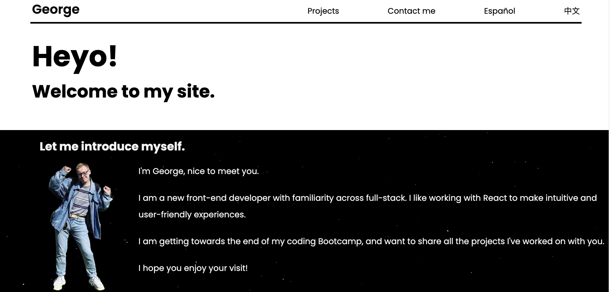
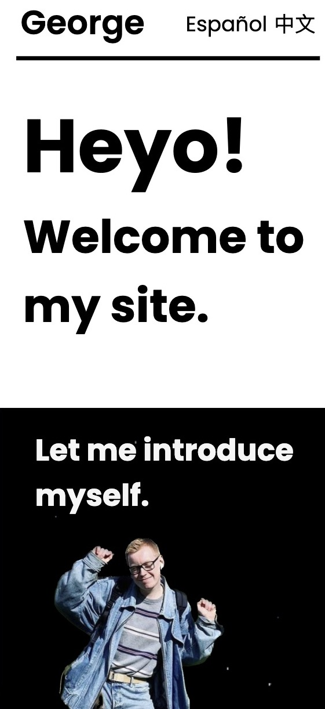

# George's Portfolio Website

## Description
This is the third time I've made a portfolio website. I have used my time at Command Shift (FKA Manchester Codes) to learn loads about web development, and hopefully that shows in this website.

I hope this site shows my passion for simple, accessible and good looking web design.

## Desktop & Mobile View

## Contents

- Short intro to me.
- List of projects I've completed.
- Contact form.

## Languages
This website is available in English, Spanish and Mandarin Chinese. All content is written by me - if you think any of the Spanish or Chinese could be imporved, I'd be super grateful!

## The Future
As I work on more projects, I will add the best ones to the site. This won't be quick, as I need to write content in 3 languages for each project!

## Thanks to:
- The tutors at Command Shift for all their help and support! 
- Emma for her design expertise and content writing experience!
- me : for working so hard. :)

George - 2023